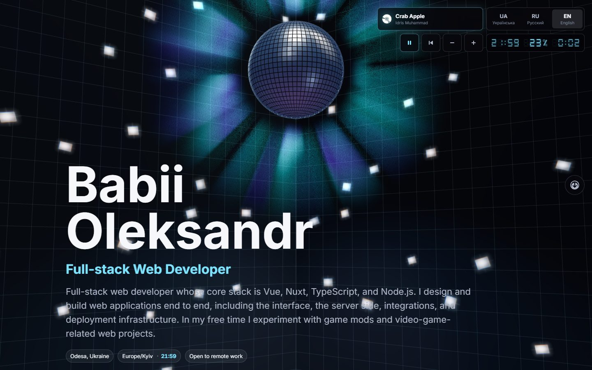
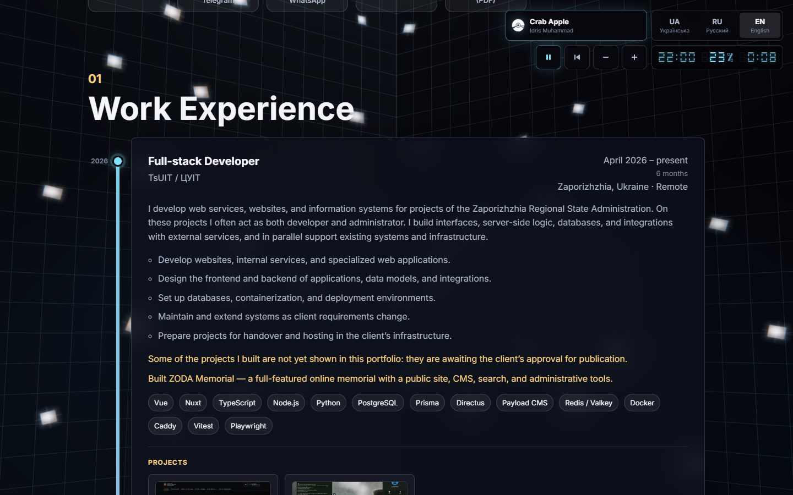
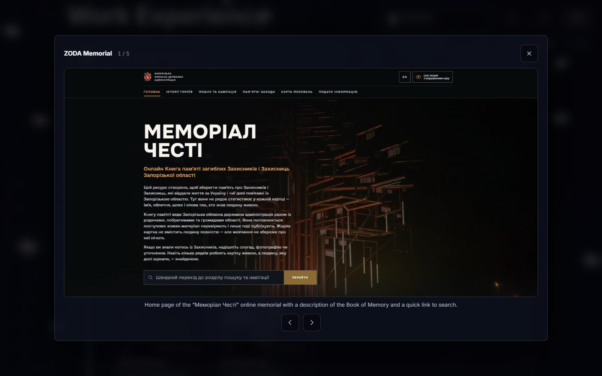
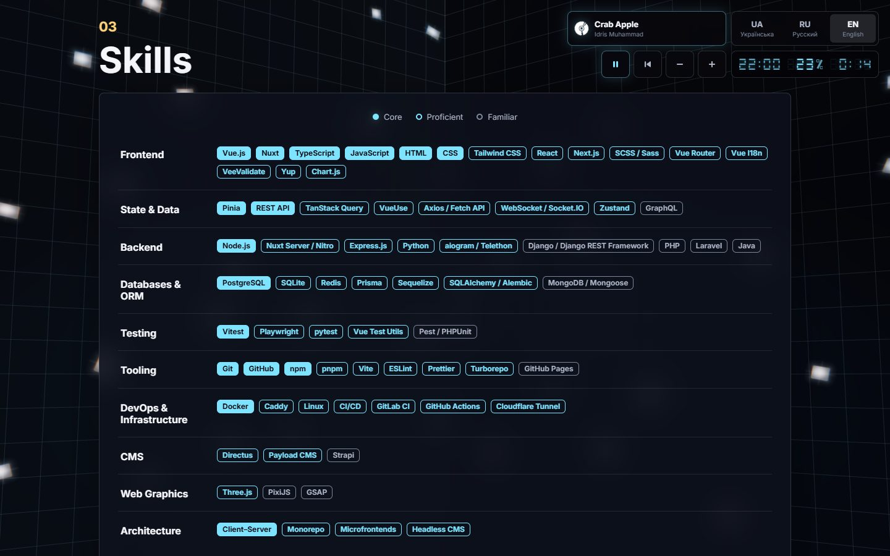
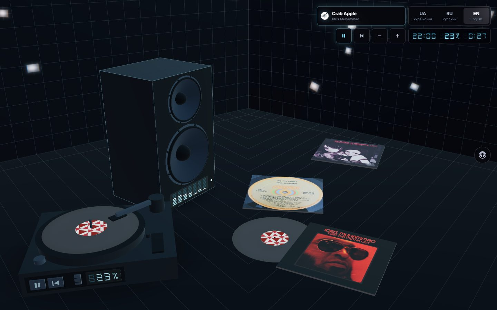
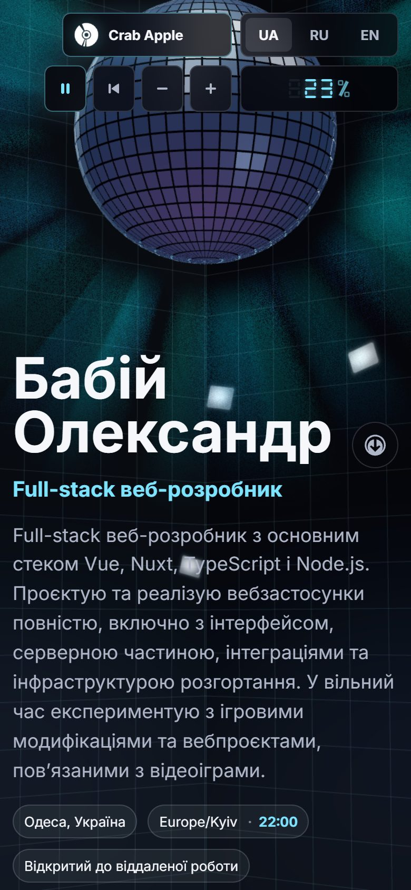

# DiscoCV

**English** | [Українська](README.uk.md)

An interactive resume and portfolio set in a 3D disco room. A mirror ball throws light across the walls, a record player and speaker react to the music, and the page itself is a full CV: experience, projects, skills and a downloadable PDF, in three languages.

**Live site:** https://konradiuss.github.io/MyDiscoCV/



## Features

- **3D disco room** built with Three.js: a spinning mirror ball, reflected light spots travelling across the walls, a glow around the ball and a floor grid that follows the room's perspective.
- **Music player** with play, restart and volume controls in the corner and on the turntable in the room. The speaker cones and the level meter react to the track through the Web Audio API.
- **Record sleeves on the floor**: each one is a track. Hover to pick one up, click to play it.
- **Three languages**: Ukrainian, Russian and English, each with its own URL (`/ua`, `/ru`, `/en`) and its own PDF resume.
- **Career timeline** with the current job highlighted, gaps between jobs dimmed and durations calculated from the dates.
- **Project screenshots** in a keyboard-accessible viewer.
- **One-page PDF resumes** generated from the same data as the site.
- **Responsive** down to 320px, with support for `prefers-reduced-motion` and print styles.
- **Accessible controls**: every control in the 3D scene is a real HTML button or slider with a label and keyboard support.
- **No backend**: a static site, deployed to GitHub Pages.

| Work experience | Project screenshots |
| --- | --- |
|  |  |

| Skills | The floor at the end of the page |
| --- | --- |
|  |  |

<p align="center">
  
</p>

## Tech stack

- [Vue 3](https://vuejs.org/) with `<script setup>` and TypeScript
- [Vite](https://vite.dev/) and [Vue Router](https://router.vuejs.org/)
- [Three.js](https://threejs.org/) with custom GLSL shaders
- [Vitest](https://vitest.dev/) and Vue Test Utils for unit tests
- [Playwright](https://playwright.dev/) for end-to-end tests and PDF generation
- ESLint, Oxlint and Prettier

## Project structure

```text
src/
├── data/
│   ├── resume.ts        # all resume content, one block per language
│   └── playlist.ts      # the music playlist
├── assets/
│   ├── audio/           # music tracks
│   ├── covers/          # album artwork for the record sleeves
│   ├── avatars/         # profile pictures for the contact tiles
│   ├── shots-source/    # project screenshots as they came out of the capture
│   ├── shots/           # the WebP the site ships, built from shots-source/
│   ├── documents/       # generated PDF resumes
│   └── main.css         # site styles
├── components/
│   ├── DiscoRoomBackground.vue   # the 3D scene
│   ├── disco/           # scene geometry, reflections, shaders, floor layout
│   ├── controls/        # music controls, seven-segment readouts, scrolling
│   └── resume/          # dates, timeline, screenshot viewer state
├── audio/               # music player and audio analysis
├── loading/             # loading screen
└── __tests__/           # unit tests
e2e/                     # Playwright tests
scripts/
└── build-resume-pdf.ts  # PDF resume generator
```

### Changing the content

- **Resume text**: edit `src/data/resume.ts`. Each language is written out in full. The unit tests check that dates, stacks, links and screenshots match across the three languages.
- **Screenshots**: put the original in `src/assets/shots-source/`, run `npm run shots:optimize`, and reference the generated `.webp` name in `resume.ts`. The originals are kept so the settings can change without ever recompressing an already compressed picture; only `src/assets/shots/` is bundled.
- **Music**: put the track in `src/assets/audio/` and its cover in `src/assets/covers/`, then add an entry to `src/data/playlist.ts`.
- **PDF resumes**: run `npm run resume:pdf` after changing the content.
- **Link previews**: `index.html` carries the English tags between the `share-meta` markers, and the build writes a localised copy of them into `/ua`, `/ru` and `/en` — see `scripts/shareMeta.ts`. The description follows `profile.summary` on its own, but the picture has the name, title, location and availability baked in, so run `npm run share:image` after changing any of those four.

## Getting started

Requires Node.js 22.18+ or 24.12+.

```sh
npm install
npm run dev
```

Then open http://localhost:5173.

### Scripts

| Command | What it does |
| --- | --- |
| `npm run dev` | Start the dev server |
| `npm run build` | Type-check and build for production |
| `npm run preview` | Serve the production build locally |
| `npm run test:unit` | Run unit tests with Vitest |
| `npm run test:e2e` | Run end-to-end tests with Playwright (run `npx playwright install` first) |
| `npm run resume:pdf` | Generate the PDF resumes (`-- en` for one language, `-- --preview` to also save PNG previews) |
| `npm run shots:optimize` | Build the shipped screenshots from `src/assets/shots-source/` (`-- --force` to rebuild everything, `-- --width`/`-- --quality` to change the settings) |
| `npm run share:image` | Photograph the room for the link previews (`-- en` for one language, `-- --skip-build` to reuse `dist/`, `-- --motion` to let the halo animate first) |
| `npm run icons:build` | Build the home-screen icons and `site.webmanifest` from `compact-disc.svg` |
| `npm run lint` | Run Oxlint and ESLint |
| `npm run format` | Format the code with Prettier |

## Deployment

The site is deployed to GitHub Pages by [`.github/workflows/deploy.yml`](.github/workflows/deploy.yml) on every push to `main`. The workflow runs the unit tests, builds the site and publishes `dist/`.

To deploy a fork:

1. Open **Settings → Pages** in the repository and set **Source** to **GitHub Actions**.
2. Push to `main`, or run the workflow manually from the **Actions** tab.

The build takes its base path from the `PAGES_BASE` environment variable, which the workflow sets to `/<repository-name>/`. GitHub Pages has no fallback for single-page apps, so the build also writes a copy of `index.html` for each language route and a `404.html`.

## License

The source code is released under the [MIT License](LICENSE).

The license does not cover the personal content of this repository: resume text, photographs, work-project screenshots and PDF resumes.

### Third-party content

- **Music and album artwork** belong to their rights holders and are used here for non-commercial purposes only:
  - "Crab Apple" by Idris Muhammad
  - "Brand New Girl" by Billy Garner Band
  - "Welcome to VA-11 HALL-A" by Garoad
- **Inter** font by Rasmus Andersson, under the [SIL Open Font License 1.1](https://github.com/rsms/inter/blob/master/LICENSE.txt).
- **Prismatic Burst** and **Click Spark** effects are adapted from [vue-bits](https://vue-bits.dev/) by David Haz (MIT + Commons Clause).
- The PDF resume layout is based on [Jake's Resume](https://github.com/jakegut/resume) (MIT).
